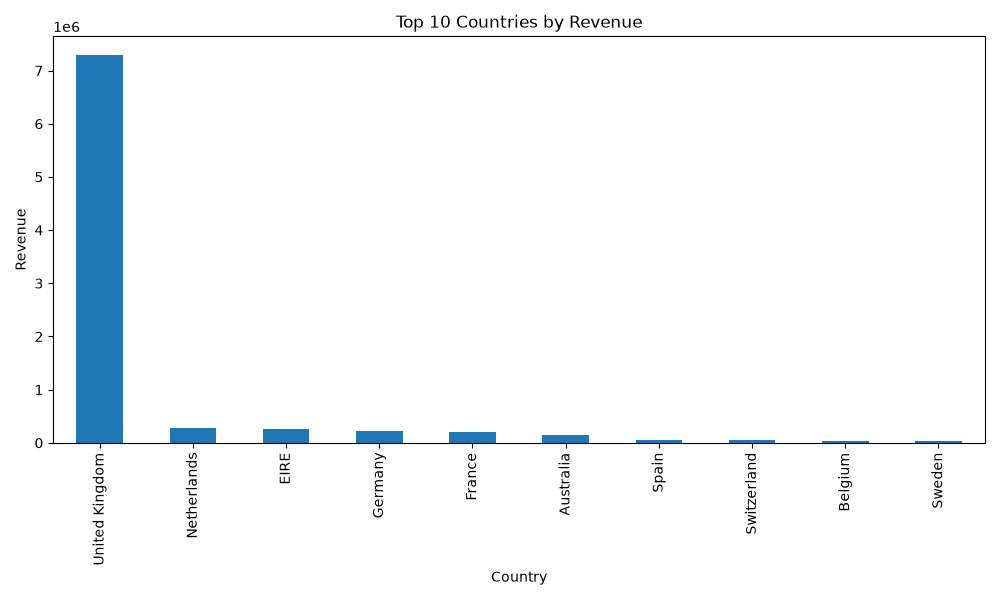
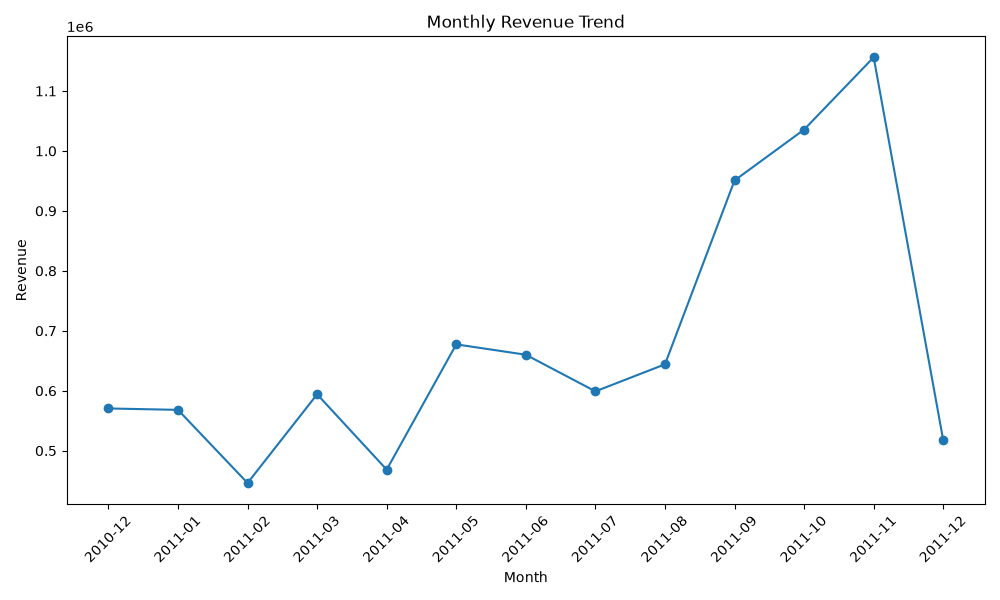
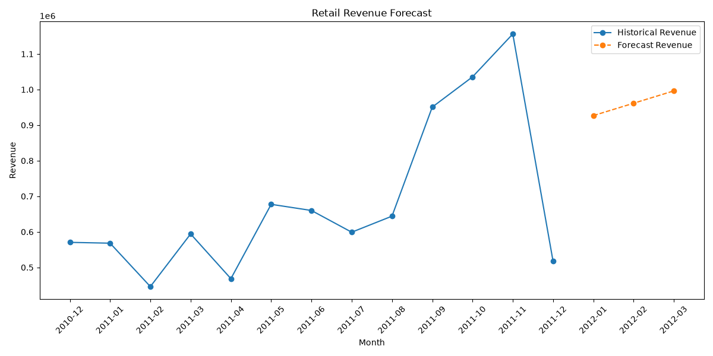
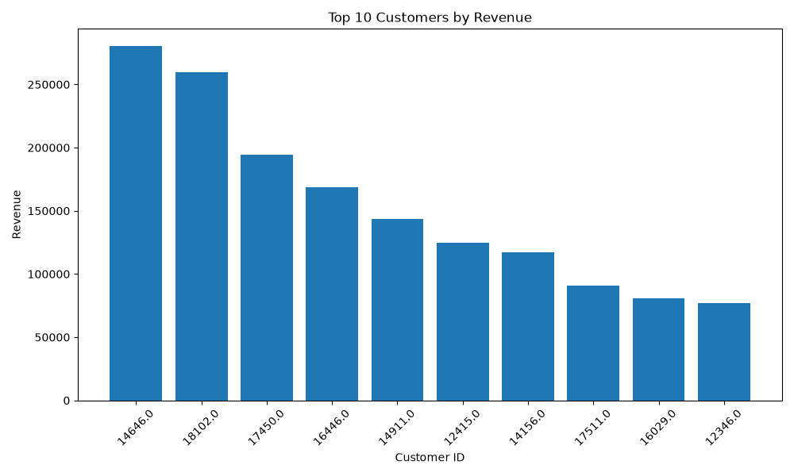

# Retail Demand Forecasting Platform

End-to-end retail analytics and demand forecasting platform built using Python, Pandas, data quality validation, customer analytics, visualization, and forecasting techniques.

## Project Overview

This project demonstrates a complete data engineering and analytics workflow using a real-world retail dataset containing over 500,000 transactions.

The platform performs:

* Data ingestion and profiling
* Data quality assessment
* Data cleansing and transformation
* Business KPI generation
* Customer analytics
* Revenue trend analysis
* Demand forecasting
* Data visualization

---

## Dataset

Online Retail Dataset

### Dataset Statistics

| Metric           | Value   |
| ---------------- | ------- |
| Original Records | 541,909 |
| Clean Records    | 392,692 |
| Countries        | 37      |
| Customers        | 4,300+  |
| Products         | 3,600+  |

---

## Architecture

```text
Online Retail Dataset
        ↓
Data Ingestion
        ↓
Data Profiling
        ↓
Data Quality Validation
        ↓
Data Cleansing
        ↓
Business KPI Analysis
        ↓
Customer Analytics
        ↓
Visualization
        ↓
Revenue Forecasting
```

---

## Data Quality Findings

| Metric               | Count   |
| -------------------- | ------- |
| Missing Customer IDs | 135,080 |
| Missing Descriptions | 1,454   |
| Duplicate Records    | 5,268   |
| Negative Quantities  | 10,624  |
| Negative Prices      | 2       |

---

## Business Insights

### Top Revenue Countries

1. United Kingdom
2. Netherlands
3. EIRE
4. Germany
5. France

### Top Revenue Products

1. PAPER CRAFT, LITTLE BIRDIE
2. REGENCY CAKESTAND 3 TIER
3. WHITE HANGING HEART T-LIGHT HOLDER
4. JUMBO BAG RED RETROSPOT
5. MEDIUM CERAMIC TOP STORAGE JAR

---

## Customer Analytics

The platform generates customer-level insights including:

* Customer revenue analysis
* Order frequency analysis
* Average order value calculations
* Top customer identification

Output dataset:

```text
data/processed/customer_revenue.csv
```

---

## Forecasting

A baseline Linear Regression model is used to forecast future monthly revenue.

### Forecast Results

| Month    | Forecast Revenue |
| -------- | ---------------- |
| Month 13 | 926,791          |
| Month 14 | 961,528          |
| Month 15 | 996,265          |

### Forecasting Limitations

The current forecasting implementation is a baseline model.

Known limitations:

* Only 13 monthly observations are available
* Strong seasonal patterns exist
* December 2011 appears incomplete
* Model does not currently account for seasonality
* Forecasts should be treated as directional estimates

Future versions will include:

* Seasonality-aware forecasting models
* Model evaluation metrics
* Feature engineering
* Train/test validation
* Advanced forecasting techniques

---

## Visualizations

### Top Countries by Revenue



### Monthly Revenue Trend



### Revenue Forecast



### Top Customers by Revenue



---

## Technology Stack

### Data Engineering

* Python
* Pandas
* NumPy

### Analytics & Forecasting

* Scikit-learn
* Linear Regression

### Visualization

* Matplotlib

### Version Control

* Git
* GitHub

---

## Repository Structure

```text
retail-demand-forecasting-platform
│
├── data
│   ├── sample
│   └── processed
│
├── docs
│   └── images
│
├── src
│   ├── ingestion
│   ├── transformation
│   └── forecasting
│
├── tests
│
├── notebooks
│
├── README.md
└── requirements.txt
```

---

## Current Features

### Completed

* Data ingestion pipeline
* Data profiling
* Data quality validation
* Data cleansing
* KPI analysis
* Country revenue analysis
* Customer revenue analysis
* Monthly revenue aggregation
* Revenue forecasting
* Data visualizations
* GitHub pull request workflow

### Planned Enhancements

* RFM customer segmentation
* Customer clustering
* Forecast model improvements
* Unit testing
* Docker support
* CI/CD automation
* AWS deployment

---

## Author

Nazmul Laskar

Senior Data Engineer | Platform Engineer | AWS Data Engineering | DevOps

GitHub: https://github.com/nazzmca
